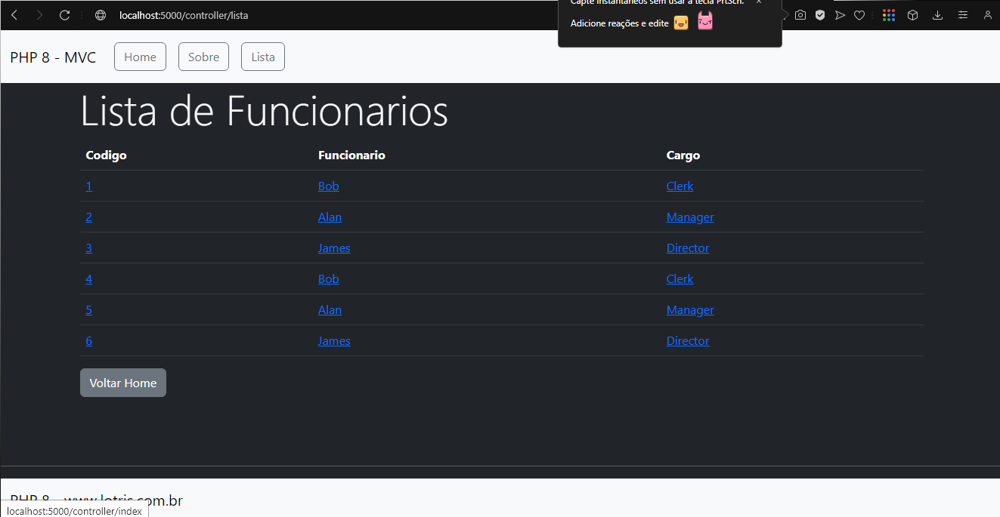

<h1 align="center">
    
</h1>
<h4 align="center"> 
# Projeto em PHP8 - MVC 
</h4>

## 💻 Sobre o projeto

♻ ️PHP - 8 MVC

    Este projeto mostra de forma simples e objetiva de um sistema de rotas com php8.

    - Usando composer com autoloader pra comunicação das classes e injeção de componentes;

    - Template views;

    - bootstarp;

    - MVC;

    - URL amigavel.

    Tudo isto com boas pratica de programação orientada em objetos - POO.

## 📝 Licença

Este projeto esta sobe a licença DEV.

Feito com ❤️ por Marcos Andre 👋🏽 [Entre em contato!](https://www.linkedin.com/in/mare-marcos-andre/)

